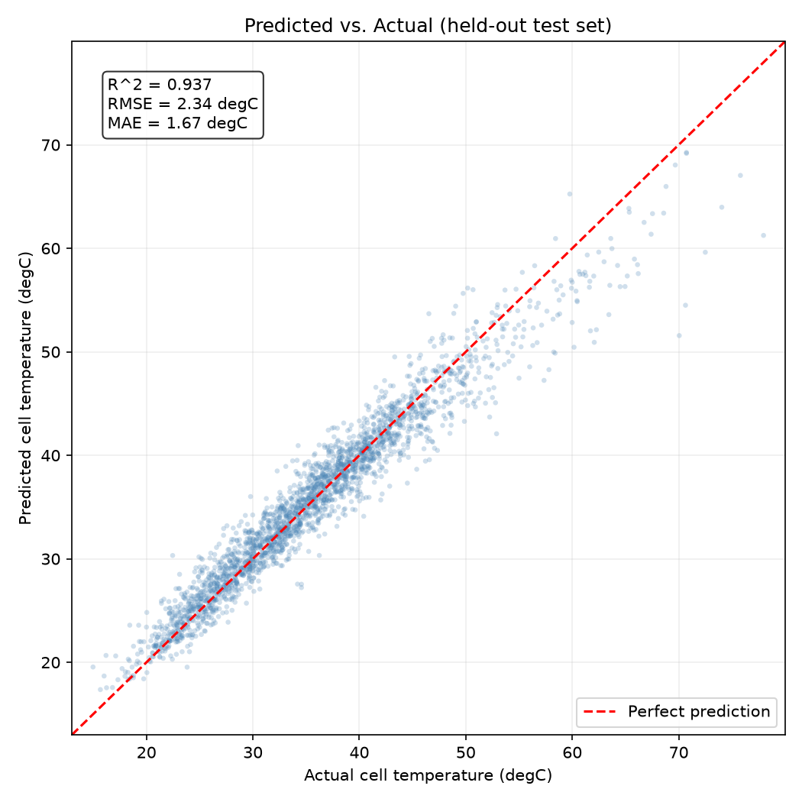
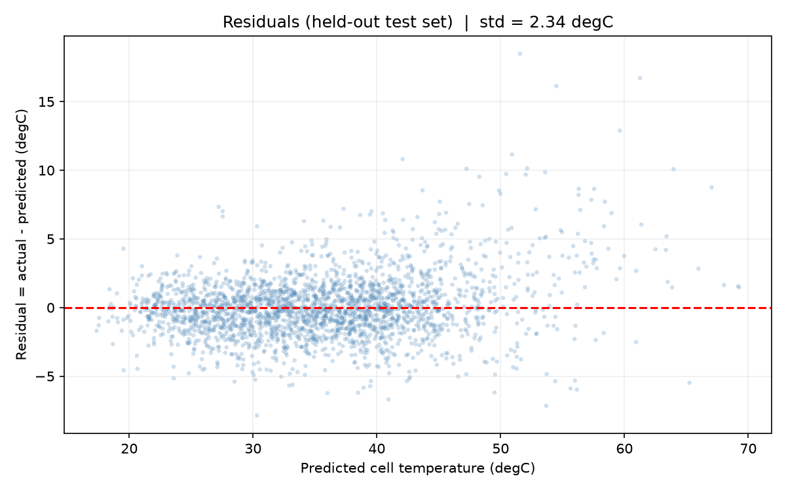
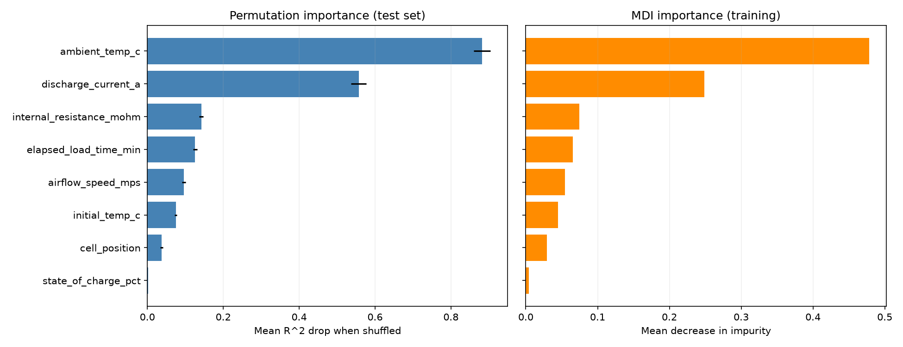

# Battery Cell Temperature Prediction

A scikit-learn **random-forest regression model** that predicts lithium-ion battery
cell temperatures from operating and design parameters — built as a cheap, fast
**surrogate for expensive CFD thermal simulation**.

> **Portfolio note.** This repository is a self-contained, reproducible reconstruction
> of work I did at **Ghost Electric Motorcycles**. Because the real bench-test data is
> proprietary, this repo trains on physically-grounded synthetic data that I
> generate from a documented thermal model. Every metric reported below is produced by
> *this* synthetic pipeline.

---

## Real-world context

On the software/electrical team at Ghost Electric Motorcycles, I trained and validated a
random-forest regression model on 10,000+ bench-test data points to predict battery
cell temperatures. The model acted as a surrogate for CFD thermal simulation. Instead
of running a full computational-fluid-dynamics solve on every pack design iteration, the
team could query the model in milliseconds to predict where cells would run hot from the
operating and design parameters. This let us:

- **Screen pack designs** without running CFD on every iteration.
- **Guide heat-sink placement and cell-layout decisions** by identifying hot-spot drivers.

> **Note**
> On the real project, with real bench data, this approach reduced CFD iterations by
> **~65%** and improved heat dissipation by **~40%**. **Those figures come from the real
> hardware project and are NOT outputs of this repository.** They are stated here only as
> real-world context. Everything in the [Results](#results) section below is the genuine
> output of this synthetic demo and nothing else.

---

## How the synthetic data is generated

The generator (`src/generate_data.py`) is built on the **first-order lumped-capacitance
thermal model** — the standard textbook description of a body that heats under a load
while losing heat to its surroundings by convection. Each term is physically motivated so
the modeling story holds up under scrutiny.

**1. Heat generation (Joule heating).**  Power dissipated inside the cell:

```
Q_gen = I² · R_eff        [W]
R_eff = R_nominal · (1 + 0.30 · (1 − SOC/100))
```

`P = I²R` is the dominant self-heating mechanism. Internal resistance rises as a cell
depletes, so the *effective* heat-producing resistance grows slightly at low state-of-charge.

**2. Heat removal (Newton's law of cooling).**  Heat lost to ambient scales with the
temperature difference and a conductance `hA` (W/°C) that improves with forced airflow and
worsens for poorly-ventilated interior cells:

```
Q_out = hA · (T_cell − T_ambient)
hA     = base_hA · position_factor · (1 + k_air · airflow)
position_factor = 1 − 0.50 · (cell_position / 9)      # 0 = edge, 9 = center
```

**3. Steady-state temperature.**  Setting `Q_gen = Q_out`:

```
T_steady = T_ambient + Q_gen / hA
```

**4. Transient approach (first-order lag).**  A cell does not reach steady state instantly;
it approaches it with thermal time constant `τ`:

```
approach = 1 − exp(−t / τ)
T(t)     = T_initial + (T_steady − T_initial) · approach
```

At `t = 0` the cell sits at `T_initial`; as `t → ∞` it approaches `T_steady`. This makes
both **elapsed load time** and **initial temperature** physically meaningful.

**5. Sensor noise.**  Gaussian noise (σ = 1.2 °C) is added to mimic a real
thermistor/thermocouple reading.

**Calibration is honest about its limits:** the absolute per-cell wattages are synthetic
lumped values, and the constants (`base_hA = 1.6`, `k_air = 0.25`, `τ = 25 min`, etc.) were
chosen so cell temperatures land in a **physically plausible Li-ion band** — the generated
data spans **15.0 – 89.0 °C** (median 34.8 °C), staying below thermal-runaway territory. The
*functional relationships* are the physics; absolute calibration would come from real cells.

### Features

| Feature | Unit | Range | Role in the physics |
|---|---|---|---|
| `ambient_temp_c` | °C | 15 – 45 | Baseline the cell sits on |
| `discharge_current_a` | A | 5 – 38 | Drives `I²R` heating |
| `state_of_charge_pct` | % | 10 – 100 | Modulates effective resistance |
| `internal_resistance_mohm` | mΩ | 12 – 45 | Scales `I²R` heating |
| `airflow_speed_mps` | m/s | 0.5 – 8.0 | Convective cooling strength |
| `cell_position` | index | 0 – 9 | 0 = edge (well-cooled), 9 = center (hot) |
| `elapsed_load_time_min` | min | 10 – 60 | Transient heat accumulation |
| `initial_temp_c` | °C | 18 – 40 | Starting thermal state |

**Target:** `cell_temperature_c` (°C). **Rows:** 12,000.

---

## Model

A **`RandomForestRegressor`** (scikit-learn). Rationale:

- The target is a **nonlinear function of interacting inputs** (`I²R` divided by an
  airflow/position-dependent conductance, approached transiently over time). Trees capture
  those interactions with no manual feature engineering.
- **No feature scaling needed** — trees are invariant to monotonic transforms of individual
  features.
- **Interpretable feature importances**, which directly support the design-decision story.

**Hyperparameters** (kept deliberately simple and explainable — not grid-searched):

| Parameter | Value | Why |
|---|---|---|
| `n_estimators` | 300 | More trees → lower-variance averaging; returns flatten well before 300. |
| `min_samples_leaf` | 5 | Each leaf averages ≥ 5 cells, smoothing the ±1.2 °C sensor noise instead of memorizing it. This is the single regularization knob; `max_depth` is left unbounded and controlled through leaf size. |
| `oob_score` | True | Free out-of-bag generalization estimate (each tree scores the ~⅓ of samples it never saw). |
| `random_state` | 42 | Reproducibility. |

---

## Results

All numbers below are produced by this synthetic pipeline (seed = 42, fully reproducible).

### Accuracy on the held-out test set (2,400 samples)

| Metric | Random Forest | Baseline (predict mean) |
|---|---|---|
| **RMSE** | **2.34 °C** | 9.33 °C |
| **MAE** | **1.67 °C** | 7.32 °C |
| **R²** | **0.937** | −0.000 |

The model **cuts RMSE by 74.9%** versus the trivial mean-predictor baseline — quantifying
that the features carry real signal rather than the model just learning the average.

### Generalization checks (three independent estimates agree)

| Estimate | R² | RMSE |
|---|---|---|
| Held-out test set | 0.937 | 2.34 °C |
| Out-of-bag (training time) | 0.939 | — |
| 5-fold CV on training data | 0.934 ± 0.003 | 2.35 ± 0.07 °C |

Test ≈ OOB ≈ CV, and the CV standard deviation is tiny — strong evidence the model
**generalizes and is not overfitting**. (CV is run on the training split only, so the test
set stays a genuine final check.) The residual RMSE of ~2.3 °C sits just above the
irreducible 1.2 °C sensor-noise floor, which is the expected behavior for a well-fit model.

### Diagnostic plots

| Predicted vs. Actual | Residuals |
|---|---|
|  |  |

Residuals are centered on zero with no strong structure. The predicted-vs-actual plot shows
a slight **under-prediction in the hot tail (> ~65 °C)** — expected, because random-forest
regression averages toward the mean and there are fewer training samples in that sparse
high-temperature region. A real deployment would address this with more hot-region sampling
or quantile/gradient-boosted models (see [next steps](#what-id-do-with-real-data)).

### Feature importances

Two views are reported. **Permutation importance** (measured on the held-out test set) is
the headline number because it is model-agnostic and unbiased; **MDI** (impurity-based) is
shown alongside because it is the common default but is known to be **biased toward
high-cardinality continuous features** — knowing that distinction matters.



| Feature | Permutation (R² drop) | MDI | Physics interpretation |
|---|---:|---:|---|
| `ambient_temp_c` | 0.882 | 0.478 | Sets the baseline; widest input range, so largest variance contribution. |
| `discharge_current_a` | 0.557 | 0.249 | Largest *controllable* driver — heating scales with **I²**. |
| `internal_resistance_mohm` | 0.142 | 0.075 | Directly scales `P = I²R`. |
| `elapsed_load_time_min` | 0.126 | 0.065 | Heat accumulates over time toward steady state. |
| `airflow_speed_mps` | 0.096 | 0.054 | **Convective cooling** — a design lever (heat-sinking / ducting). |
| `initial_temp_c` | 0.075 | 0.045 | Starting point; matters most for shorter loads. |
| `cell_position` | 0.038 | 0.030 | **Layout** — center cells run hotter (less ventilation). |
| `state_of_charge_pct` | 0.002 | 0.004 | Minor; only a mild effect on effective resistance. |

**Why this supports the design story.** The top drivers (`ambient`, `current`, `resistance`)
match the dominant `I²R`-over-baseline physics. Critically, the two **design-controllable**
features — `airflow_speed_mps` and `cell_position` — are both **clearly above the noise floor**
(their permutation means dwarf their ± std and sit well above `state_of_charge`). That is the
quantitative basis for "the model guided heat-sink placement and layout": it confirms cooling
airflow and cell position are real, rank-able levers on hot-spot temperature.

---

## Limitations (read before judging the metrics)

I'd rather state these than have them found:

- **The data is synthetic, so the validation is partly circular.** The model is learning a
  function I defined in `generate_data.py` (plus 1.2 °C of noise). A test R² of 0.937 therefore
  demonstrates that *the ML pipeline is sound* — the split is honest, the model generalizes,
  it crushes the baseline — **not** that it has discovered real battery physics. Confirming the
  latter requires real bench data, which is exactly the point of the
  [next-steps](#what-id-do-with-real-data) section.
- **The ceiling is the noise floor.** Because the only irreducible error is the injected
  sensor noise, RMSE can't beat ~1.2 °C. The model lands at ~2.3 °C (a little above the floor,
  as expected for a forest with finite trees and leaf smoothing) — realistic, not suspiciously
  perfect.
- **Constants are calibrated, not measured.** Temperatures sit in a plausible Li-ion band by
  *construction*; the relationships are physical, the absolute numbers are not from a real cell.

## Quickstart

Requires **Python 3.11+** (built and verified on 3.13).

```bash
# 1. Clone
git clone https://github.com/lucaslombanaarias/Battery-Cell-Temperature-Prediction.git
cd Battery-Cell-Temperature-Prediction

# 2. Create an isolated environment and install pinned dependencies
python -m venv .venv
# Windows:
.venv\Scripts\activate
# macOS/Linux:
# source .venv/bin/activate
pip install -r requirements.txt

# 3. Run the pipeline
python src/generate_data.py   # -> data/battery_thermal_data.csv  (12,000 rows)
python src/train.py           # -> models/rf_model.joblib  (+ train/test splits)
python src/evaluate.py        # -> prints metrics; writes reports/ (plots + metrics.json)
```

Everything is reproducible: fixed seed (42), pinned dependencies, and a seeded train/test
split persisted to disk so evaluation always scores the identical held-out rows.

---

## Project structure

```
Ghost_Battery_Prediction/
├── src/
│   ├── generate_data.py     # Physics-based synthetic data generator
│   ├── train.py             # Random-forest training (+ OOB, saves splits)
│   └── evaluate.py          # Metrics, CV, baseline, permutation importance, plots
├── reports/                 # Committed outputs so figures render on GitHub
│   ├── predicted_vs_actual.png
│   ├── residuals.png
│   ├── feature_importances.png
│   └── metrics.json         # Machine-readable results
├── data/                    # Generated CSVs (gitignored, regenerable)
├── models/                  # Trained model (gitignored, regenerable)
├── requirements.txt         # Exact pinned versions (Python 3.13)
├── .gitignore
└── README.md
```

---

## What I'd do with real data

The synthetic generator encodes assumptions I *chose*; real data would test them. With actual
bench-test data I would:

1. **EDA first** — check for sensor drift, missing values, and outlier runs, and verify the
   real feature correlations against the synthetic assumptions.
2. **Feature-engineer from physics** — cumulative energy input (∫ I²R dt), temperature
   rate-of-change, and gradients between neighboring cells.
3. **Respect time-series structure** — real thermal data is sequential; I'd add lag features
   or use sequence models to capture thermal inertia rather than treating rows as IID.
4. **Tune honestly** — cross-validated search over `min_samples_leaf` / `n_estimators`,
   justified by the data's actual complexity.
5. **Benchmark alternatives** — gradient-boosted trees (XGBoost/LightGBM) and a small MLP,
   plus **quantile regression** to fix the hot-tail under-prediction seen above.
6. **Quantify uncertainty** — use per-tree spread for prediction intervals, which matters for
   safety-margin decisions.
7. **Validate against CFD/bench** — confirm the surrogate agrees with the simulation it is
   meant to replace before trusting it for design screening.

---

## Tech stack

Python · NumPy · pandas · scikit-learn · Matplotlib · joblib
